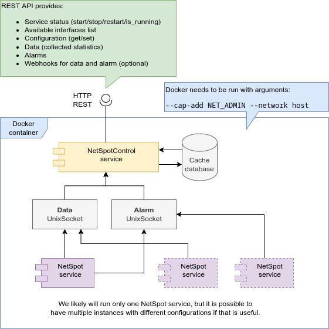

# WP4 netspot

This repository is for implementing SIFIS-Home WP4 Multi-Level Analysis using the SPOT algorithm. The solution is planned to run as a docker container where the controlling program provides HTTP REST API for other services. The controlling service is designed to run netspot programs and collect data to the cache database.

Below is initial plans for the service.



## Project folders

* docs – Documentation and plans
* netspot_control - Rust project for developing the planned service
  * Currently implements only listing of host system network interface

## Netspot

We are planning to use the following Go Implementation of SPOT
https://github.com/asiffer/netspot

Python version of the algorithm is also available:
https://github.com/Amossys-team/SPOT

Project Page:
https://asiffer.github.io/netspot/

## Docker

Building docker file:

````bash
docker build --tag=netspot_control .
````

Running `netspot_control` with docker:

```bash
docker run --detach --name=netspot_control --cap-add=NET_ADMIN --network=host netspot_control
```

You can now stop container with:

```bash
docker stop netspot_control
```

And start it again with:

```bash
docker start netspot_control
```

You should be able to connect browser to http://your-docker-host:8000/.

If running on local machine try opening: http://localhost:8000/

## Roadmap

- [x] OpenAPI specification for the service
  - [x] Version 0.1.0 done — [html](docs/netspot-control-api.html) | [yaml](docs/netspot-control-api.yaml)
- [x] Checking for required technologies – The plan is to use Rust if possible
  - [x] Listing available network interfaces
  - [x] Unix sockets research
  - [x] Controlling netspot processes
    - [x] Graceful shutdown with SIGINT
  - [x] Cache database
  - [x] Running test server in docker and checking host interfaces
- [x] Dockerfile (Initial version, expecting changes)
- [ ] Writing `netspot_control` application:
  - [ ] Netspot manager
  - [ ] Writing implementation to match the designed OpenAPI specification
    - [ ] Using `rocket_okapi` could provide OpenAPI generated from the implementation
  - [ ] CORS ?
  - [ ] Authorization ?
- [ ] WP2 Checklist
  - [ ] GitHub Action
    - [ ] Code coverage
    - [ ] Continous delivery
  - [ ] Dockerfile
